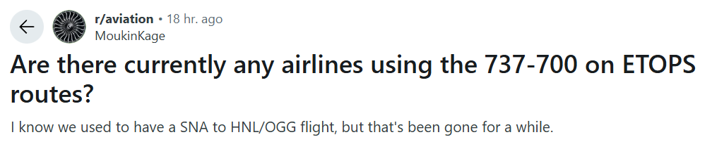
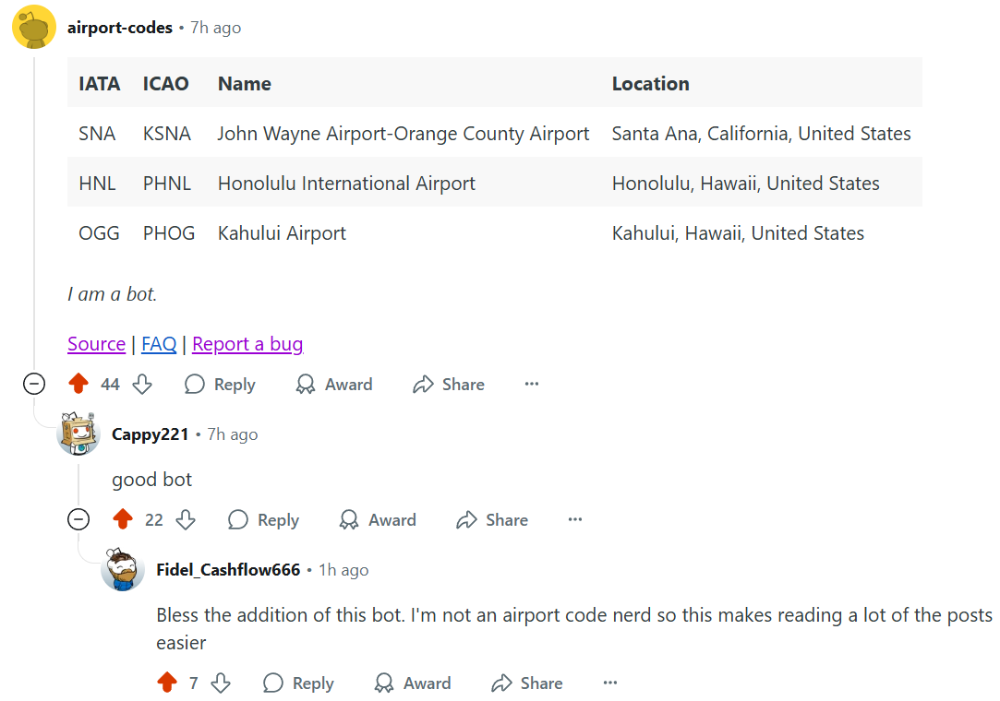

# About

This is a [Reddit app](https://developers.reddit.com/apps/airport-codes) that detects airport codes in submissions and leaves a comment with additional information about the mentioned airports. It was motivated by [this post](https://www.reddit.com/r/aviation/comments/1mc9czz/meta_can_we_include_airport_names_with_airport/) in [r/aviation](https://www.reddit.com/r/aviation/), which pointed out that many people are unfamiliar with lesser-known airport codes.

## Replies to posts

Replies to **posts** are automated. The app searches for airport codes (both [IATA](https://en.wikipedia.org/wiki/IATA_airport_code) and [ICAO](https://en.wikipedia.org/wiki/ICAO_airport_code)) in the post's title and its text. For example, if a submission is posted with the title:

> A380 spotted at SFO (inbound from DXB)

The app will leave a comment like:

|IATA|ICAO|Name|Location|
|-|-|-|-|
|SFO|KSFO|San Francisco International Airport|San Francisco, California, United States|
|DXB|OMDB|Dubai International Airport|Dubai, United Arab Emirates|

## Replies to comments

Replies to **comments** are on-demand. If there is a comment that mentions airport codes and you want to summon this app to reply with additional information, respond to the comment in question and mention this app's username, `u/airport-codes`:

> **User 1** • 3m ago
>
> There was an incident on the tarmac today at CMH

>> **User 2** • 2m ago
>>
>> Pinging u/airport-codes

>>> **airport-codes** MOD • 1m ago
>>>
>>>|IATA|ICAO|Name|Location|
>>>|-|-|-|-|
>>>|CMH|KCMH|John Glenn Columbus International Airport|Columbus, Ohio, United States|

# FAQ

## Where does the airport data come from?

The airport list is maintained in [airports.json](https://raw.githubusercontent.com/nicolewhite/reddit-airport-codes/refs/heads/main/src/db/airports.json) and was originally sourced from [mwgg/Airports](https://github.com/mwgg/Airports).

## The bot replied with an airport I didn't mention.

There can be false positives if your post contains an acronym that happens to match the IATA or ICAO code of an airport.

For example, **ILS** is commonly used to refer to the [Instrument Landing System](https://en.wikipedia.org/wiki/Instrument_landing_system) but is also the IATA code of [Ilopango International Airport](https://en.wikipedia.org/wiki/Ilopango_International_Airport) in El Salvador.

If you are the author of a post where the bot commented with inaccurate information (or if the comment is just unwanted), reply to the comment with "bad bot" and it will be deleted.

## How do I add this bot to my community?

Mods can install this app into their subreddit via the official Reddit apps marketplace.
To install this app, go to its [homepage](https://developers.reddit.com/apps/airport-codes) and click **Add to community**.

See [mod resources](https://developers.reddit.com/docs/mod_resources) for more details on installing and managing apps.

# Development

This app is developed using [Devvit](https://developers.reddit.com/docs/) and is open source on GitHub at [nicolewhite/reddit-airport-codes](https://github.com/nicolewhite/reddit-airport-codes).

# Changelog

## 0.0.8 `latest`

* Add example screenshots to README
* Fix extra space after names starting with `Mc`
* Allow author of the post to delete the comment by replying with "bad bot"
* Pull latest ignore list from GitHub rather than app configuration (there is a 250 character limit on app config)
* Sort table by IATA rather than ICAO

## 0.0.7

* Add `MIG` and `ANG` to false positives list
* Use Redis to keep track of which posts have been commented on, since the `PostSubmit` trigger can fire more than once per post submission

## 0.0.6

* Add `JAL`, `USA`, `ITA`, `AIR`, and `ALL` to the false positives list
* Allow updating the false positives list without needing to deploy a new version of the app

## 0.0.5

* Add `KLM` & `EPS` to false positives list
* Distinguish comments as being from a mod
* Sticky replies to posts (but not comments)

## 0.0.4

* The app will now reply to comments when summoned via username
* Updated countries list
* Revert "Don't repeat city and state if they are the same"

## 0.0.3

* Add FAQ
* Add links to FAQ and bug reports at bottom of comment
* Don't repeat city and state if they are the same
  * For example, `Dubai, Dubai, United Arab Emirates` will now be `Dubai, United Arab Emirates`

## 0.0.2

* Initial commit
